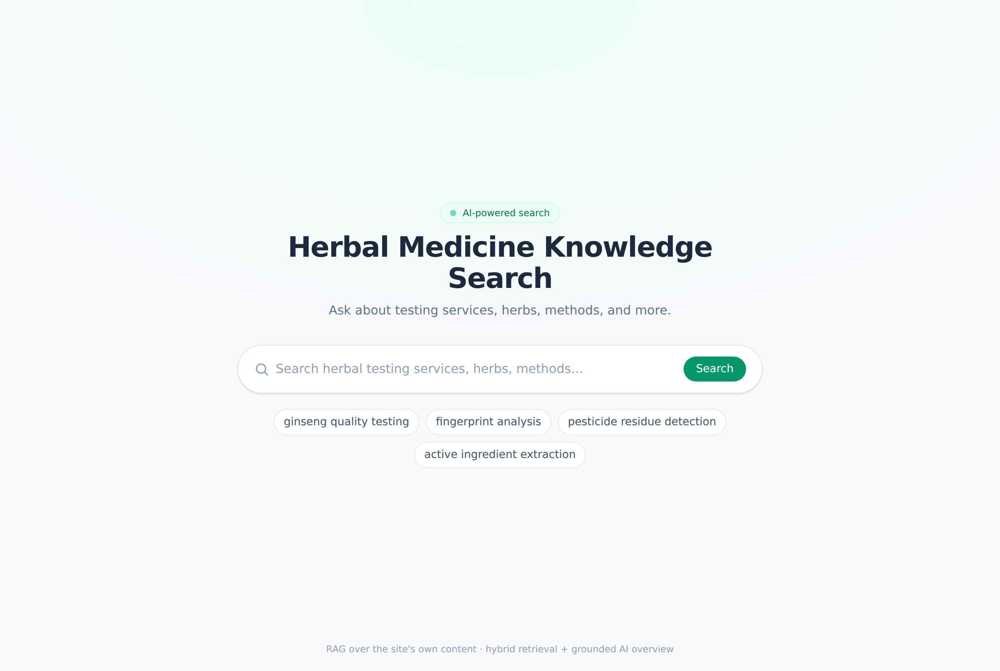
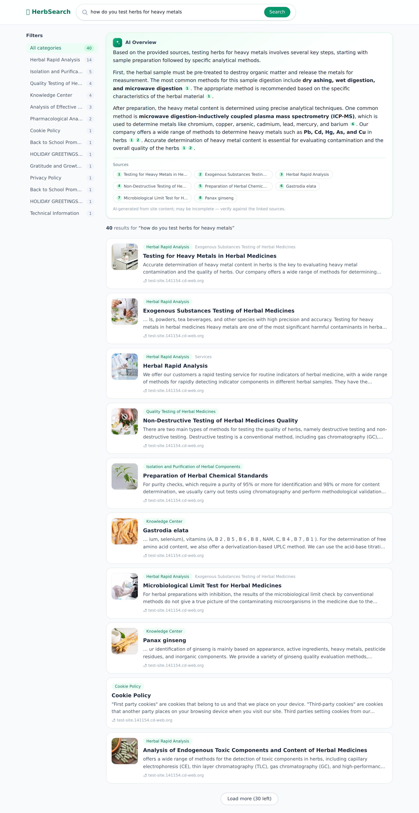
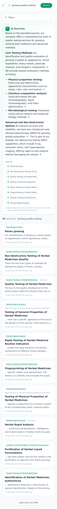

# AI Search Assistant 🌿

An **AI-powered search assistant** for the herbal-medicine testing & products
site [`test-site.141154.cd-web.org`](https://test-site.141154.cd-web.org/),
modeled on the experience of the reference site
[`ptglab.com/results`](https://www.ptglab.com/results?q=cd):

> a search box → a streaming **AI Overview** (grounded + cited) → a list of
> structured, filterable result cards.

It is a **RAG** (retrieval-augmented generation) system: the site's own content
is crawled via the WordPress REST API, indexed with hybrid (keyword + semantic)
retrieval, and summarized by an LLM with inline citations back to the source
pages.

---

## Screenshots

| Landing | Results (desktop) | Mobile |
| --- | --- | --- |
|  |  |  |

The results view: a streaming **AI Overview** with inline `[n]` citations + source
chips at the top, category **filter facets** on the left, and ranked **result
cards** below. Deep-linkable via `/?q=...` (like the reference site).

---

## What's in the box

| Package      | Stack                              | Purpose                                            |
| ------------ | ---------------------------------- | -------------------------------------------------- |
| `backend/`   | FastAPI · BGE embeddings · BM25 · OpenAI-compatible LLM | Ingestion, hybrid retrieval, streaming AI overview |
| `frontend/`  | Next.js 16 · React 19 · Tailwind v4 | Polished search UI (the standalone demo)           |
| `widget/`    | Vanilla TS · Shadow DOM · esbuild  | One-`<script>` embeddable widget for any site / WP |

```
                ┌──────────────────────────── build time ───────────────────────────┐
 WordPress  ──► fetch (REST) ──► clean HTML ──► chunk ──► embed (bge-m3) ──► index ◄─┘
 REST API                                                                  (vectors + BM25)
                ┌──────────────────────────── query time ───────────────────────────┐
   user  ──► Next.js / widget ──► /api/search ─► hybrid retrieval (RRF) ─► cards + facets
                                  /api/overview (SSE) ─► LLM summary with [n] citations
```

## Why these choices

- **Data source = the site's own WordPress REST API.** Real, structured content
  (title / body / hierarchy / images) with zero scraping. 93 pages → ~480 chunks.
- **Hybrid retrieval (BM25 + dense + RRF).** Keyword precision *and* semantic
  recall, fused with Reciprocal Rank Fusion. Small corpus ⇒ brute-force numpy
  cosine, no heavyweight vector DB to operate.
- **Local BGE embeddings.** Defaults to `bge-small-en-v1.5` (light, fast — the
  site content is English); swap to `bge-m3` for multilingual EN/CN. Decoupled
  from the chat LLM so the provider choice stays flexible.
- **OpenAI-compatible LLM.** Works with DeepSeek, GPT-4o, or a self-hosted
  gateway by changing three env vars.
- **Pluggable embeddings** (`bge-m3 | openai | hash`) so the pipeline runs
  end-to-end even without the model download.

---

## Quick start (local)

Prereqs: Python 3.10+, Node 18+.

```bash
# 1) Backend: install, build the index, serve
make install-backend
cp backend/.env.example backend/.env     # add LLM_API_KEY to enable AI Overview
make ingest                               # crawl + build the bge-m3 index (~once)
make dev-backend                          # http://localhost:8000  (/docs for API)

# 2) Frontend (new terminal)
make install-frontend
cp frontend/.env.local.example frontend/.env.local
make dev-frontend                         # http://localhost:3000
```

No LLM key yet? Everything still works — search + ranked results are fully
functional, and the AI Overview panel shows a "disabled" notice instead of a
summary.

No GPU / want a fast first run? Build with the dependency-free backend:

```bash
make ingest-fast      # EMBEDDING_BACKEND=hash, no model download
```

### One-command Docker demo

```bash
cp backend/.env.example backend/.env      # set LLM_API_KEY
docker compose up --build                 # backend :8000, frontend :3000
```

### Deploy to production + embed on WordPress

One command on a VPS brings up the backend + demo + widget behind Caddy with
auto-HTTPS; then a single `<script>` tag embeds the widget on the WordPress test
site. Full guide: **[DEPLOY.md](DEPLOY.md)**.

```bash
cp deploy/.env.example deploy/.env        # PUBLIC_DOMAIN, PUBLIC_URL
cp backend/.env.example backend/.env      # LLM_API_KEY, CORS_ORIGINS
./deploy/deploy.sh
```

---

## Embeddable widget

```bash
make build-widget
# open widget/index.html (a simulated host page)
```

Embed anywhere (incl. a WordPress "Custom HTML" block):

```html
<script src="/ai-search-widget.js"
        data-api-base="https://your-backend"
        data-accent="#059669"></script>
```

See [`widget/README.md`](widget/README.md).

---

## Repo layout

```
ai-search-assistant/
├── backend/          FastAPI service + ingestion + retrieval + LLM
│   ├── app/
│   │   ├── ingest/   wp_client · clean · chunk · build_index
│   │   ├── retrieval/embeddings · store · search (hybrid + RRF)
│   │   ├── llm/      overview (OpenAI-compatible streaming)
│   │   ├── api/      routes (search · suggest · overview SSE · meta)
│   │   ├── config.py
│   │   └── main.py
│   └── query.py      CLI smoke test
├── frontend/         Next.js app (SearchBar · AiOverview · ResultCard · Facets)
├── widget/           Embeddable Shadow-DOM widget
├── docker-compose.yml
└── Makefile          install · ingest · dev · build-widget
```

## API

| Endpoint        | Description                                       |
| --------------- | ------------------------------------------------- |
| `GET /api/search`   | ranked result cards + category facets (JSON)  |
| `GET /api/overview` | streaming AI overview + sources (SSE)         |
| `GET /api/suggest`  | title autosuggest                             |
| `GET /api/meta`     | index metadata (backend, counts, categories)  |
| `GET /api/health`   | liveness + index-loaded status                |

See `make help` for all tasks. Full backend notes in
[`backend/README.md`](backend/README.md).
